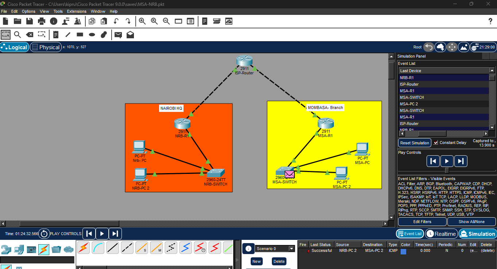
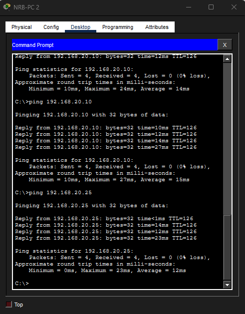
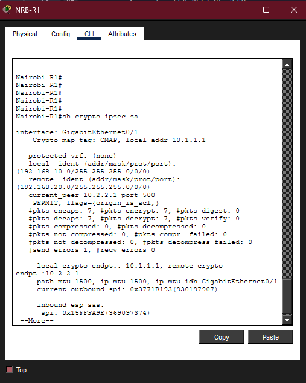

# Enterprise Site-to-Site IPsec VPN Implementation

## 📌 Executive Summary
This project demonstrates the design and deployment of a secure **Wide Area Network (WAN)** architecture for **Rorizzi Digital Services**. The objective was to securely connect the **Nairobi Headquarters** to a remote **Mombasa Branch** over a simulated public infrastructure (ISP).

By leveraging **IPsec Tunneling**, this solution ensures that sensitive internal traffic—such as Active Directory replication and file sharing—remains confidential and integrity-protected while traversing untrusted networks. This implementation simulates a real-world enterprise environment using **Cisco IOS**.



---

## 🏗️ Network Architecture

### Topology & Addressing
The network is segmented into three distinct security zones:
| Location | Role | Internal Subnet (LAN) | Public Interface (WAN) |
| :--- | :--- | :--- | :--- |
| **Nairobi HQ** | Trusted Core | `192.168.10.0/24` | `10.1.1.1/30` |
| **Mombasa Branch** | Remote Office | `192.168.20.0/24` | `10.2.2.1/30` |
| **ISP Cloud** | Untrusted Transport | N/A | `10.0.0.0/8` |

### Tech Stack
* **Simulation Engine:** Cisco Packet Tracer 8.x
* **Edge Devices:** Cisco 2911 ISR (Integrated Services Router) with `securityk9` license enabled.
* **Switching:** Cisco 2960 Access Layer Switches.
* **Routing:** Static Routing (Default Routes) for ISP reachability.

---

## 🛡️ Security Configuration (The "Tunnel" Logic)

The VPN utilizes a standard **IKEv1 (Internet Key Exchange)** framework, split into two phases to ensure robust security.

### Phase 1: ISAKMP Policy (Management Plane)
Establishes the initial secure channel ("The Handshake") for key exchange.
* **Encryption:** `AES-256` (Advanced Encryption Standard) – *Selected for military-grade confidentiality.*
* **Hashing:** `SHA` (Secure Hash Algorithm) – *Ensures packet integrity.*
* **Authentication:** `Pre-Shared Key` (PSK) – *Mutual authentication using a complex key.*
* **Diffie-Hellman:** `Group 2`.

### Phase 2: IPsec Transform Set (Data Plane)
Defines how the actual user payload is encrypted.
* **Protocol:** `ESP` (Encapsulating Security Payload).
* **Transform Set:** `esp-aes 256` + `esp-sha-hmac`.

### Access Control Lists (Traffic Filtering)
Strict Extended ACLs were implemented to differentiate "Interesting Traffic" (VPN) from regular internet traffic.
* **Rule:** Only traffic originating from `192.168.10.0/24` destined for `192.168.20.0/24` (and vice versa) triggers the tunnel.

---

## ⚙️ Implementation Highlights

### 1. Activating Security Features
Standard Cisco 2911 routers require license activation to unlock cryptographic commands.
```
license boot module c2900 technology-package securityk9
```
### 2. Crypto Map Configuration (Nairobi Side)
```
crypto map CMAP 10 ipsec-isakmp
 set peer 10.2.2.1
 set transform-set TSET
 match address 100
```
### 3. End-to-End Connectivity
Ping tests confirmed successful communication between Nairobi-PC (192.168.10.10) and Mombasa-PC (192.168.20.10) via the encrypted tunnel.


### 4. Encryption Verification
The following output confirms that packets are being encapsulated (encrypted) before leaving the WAN interface.
``` show crypto ipsec sa```

(Non-zero encapsulation values confirm the tunnel is actively securing data).

## Troubleshooting Log
During deployment, the following engineering challenges were resolved:
### 1. "MM_NO_STATE" Error:
Issue: The tunnel failed to initiate.
Root Cause: Mismatch in the set peer IP address configuration.
Resolution: Corrected the peer IP on the Nairobi router to point to Mombasa's public interface (10.2.2.1).

### 2. Request Timed Out (Black Hole):
Issue: Pings were failing despite correct routing.
Root Cause: The crypto map was applied to the LAN interface (Gi0/0) instead of the WAN interface (Gi0/1).
Resolution: Removed the map from the LAN and applied it to the ISP-facing interface.

Project Architect: Wayne Kipruto | Network Engineer
